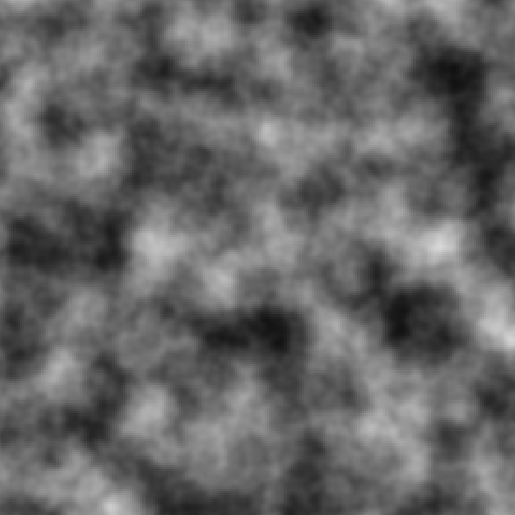
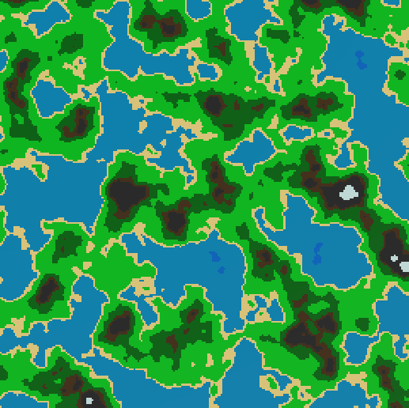
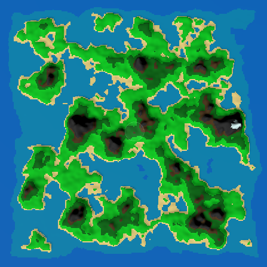

# **Noise Genarator**

A Procedural Map Generator based on Perlin-Noise. The project was made in C++.

Features implemented in the project:-
- Develop a 2d heightmap to a texture from configurable Perlin-Noise settings. This involved setting up a Perlin-Noise Generator which produces a 2d array. The array would be translated into a texture created at runtime which could be attached to a material.

- Generate a Color-map from the height map and apply it to a plane. The heightmap from before is converted to a Color-Map by defining a Struct of a Height Range and Color. The values from the heightmap are matched to the Color Range struct to get the color value and create Color-map texture. 

- Apply fall-off to create enclosed maps. By subtracting some falloff-factor and clamping the values along the edges of the heightmap we obtain a closed texture which can be used to generate a closed map as such.

- Also implemented features such as LODs to optimize CPU performance.