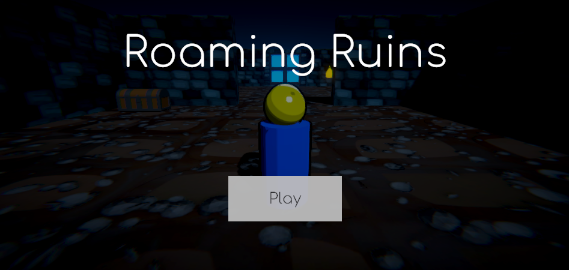
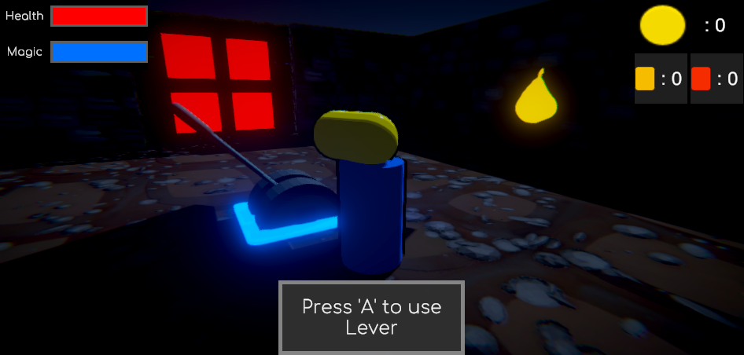
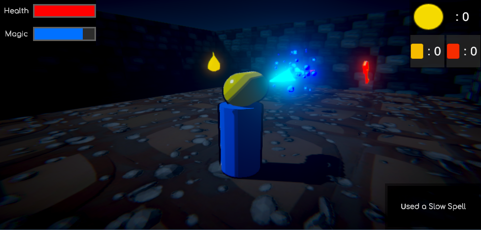

# **Roaming Ruins**

Itch: https://kingcrimson1112.itch.io/roaming-ruins

A 3D dungeon-crawler/puzzle game made in 1 week as part of Brackey’s Game Jam 2020.02. This is a solo project with all the artwork done during the 1 week period.

The main challenges of this project were:-
- Implementing a 3D Character Controller with Movable Camera as our Main Character.
- Adding a Time Reversal mechanic by storing the Rigidbody’s position for the past few seconds at any instant. (Main Theme of the Game Jam was “Reverse”)
- Developing a standard key-lock form of dungeon which the player has to traverse. This involved designing Dungeons which fully utilized the Time Reversal Mechanic. This would also involve setting up multiple ways to access the same dungeon to promote Player Freedom.

<!--  -->

- Creating standard Enemies with pathfinding and Traps in the dungeon. This would create a sense of urgency in the player while he tries to find their way through the dungeons.
- Placing Movable Platforms, Treasure Chests, and various Loot throughout the dungeon to populate them and make it more lively.
- Including Projectile Spells as means to stall the enemy and provide some other ways to solve the enemy problem.

