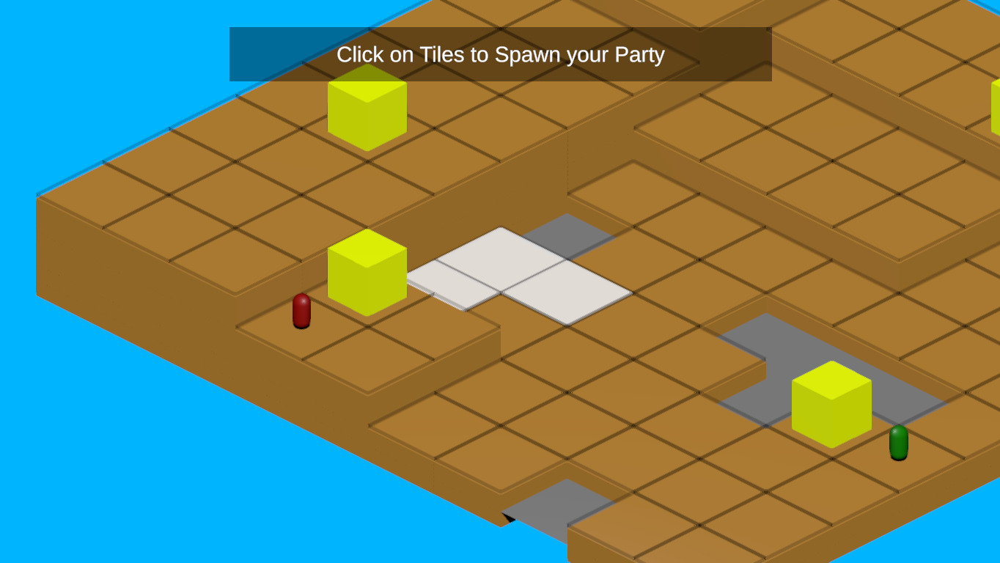
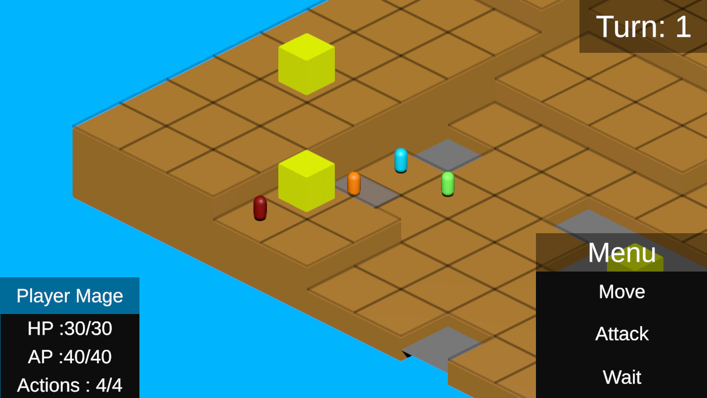
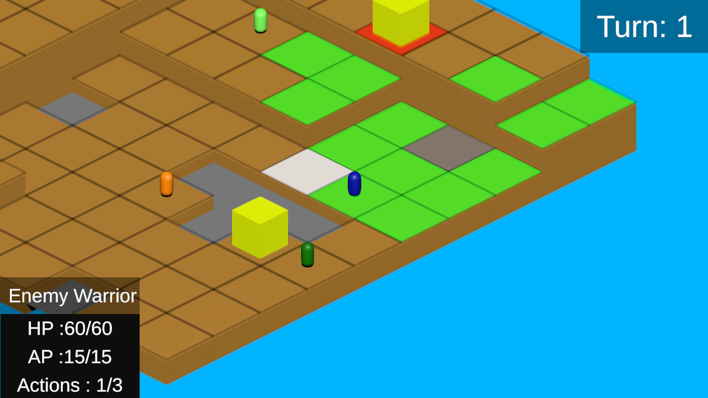

# **Tactics: RPG**
An Isometric Tactics RPG as seen in games like Final Fantasy Tactics. This project is currently not hosted anywhere. 

The main features that were implemented as part of this were:- 
- A configurable 10X10 grid with settings for the height of each tile, empty tile, obstacles, etc. The user can create levels manually or by a level generator by defining the settings of each tile in the grid.
- Enemies with pathfinding on the grid. This involves creating a history of all the tiles with their neighbouring tiles, The tiles also have occupied, blocked, unavailable and free states based on obstacle and character placement.

- Colored Tiles to display available tiles. The pathfinding algorithm would set the state of a tile as free or occupied and the color would be displayed as such.
- Turn-based Battle System based on a Speed parameter of all the characters in the Battle. All the characters make their move based on their speed value.
- A Dynamic NavMesh which is created at runtime after level instantiation of the grid and before enemy placement. This is done as the level is instantiated at runtime.

